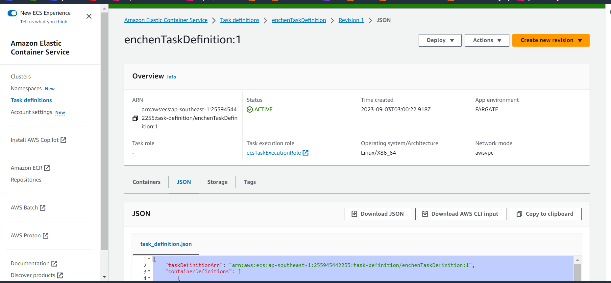

# 3.11-ecsCluster

Refer to how to create docker image from:
https://github.com/wishingbox111/containerizationll/blob/main/README.md

follow the steps stated in .github/workflows/aws.yml

ensure to add the task definition from here to file ecs-task-definition_3-11.json:

_Reference:_
- https://github.com/pglim/m3l11